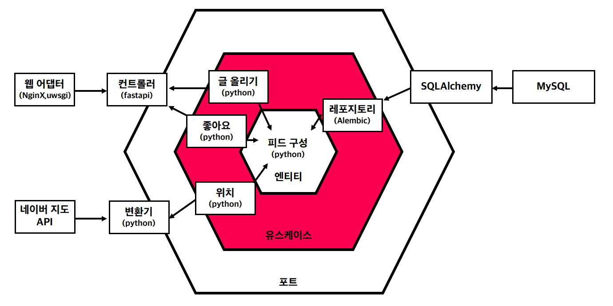

# Hexagonal-instagram
Implement instagram with Hexagonal Architecture (fastapi)

# Architecture
  
(1th edtion)  

# Requirements
- fastapi

# Execute
`pip install "fastapi[all]"`  
`uvicorn main:app --reload`  
